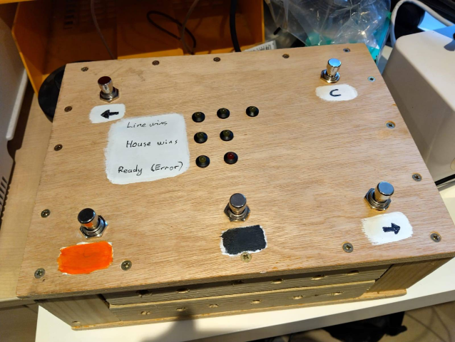

# TSS South Street App

> This repo contains the code for a one-off gig [The Small Strings](https://thesmallstrings.com/) played at South Street Arts Centre in Reading in March 2026. It is not maintained or supported, but if you find anything useful in it, have fun!

- [TSS South Street App](#tss-south-street-app)
  - [Overview](#overview)
  - [System Architecture](#system-architecture)
  - [Components](#components)

## Overview

The Small Strings South Street App is a custom software solution designed to enhance the live performance experience of the band.
It consists of a web-based UI for audience interaction, an API backend for managing game state and communication, a Python application for controlling footswitches and LEDs on a Raspberry Pi, and a Go application for managing system volume on Windows.

The browser-based UI has two main pages:
- the band page, which allows controlling which song/screen is currently displayed
- the audience page, which is intended to be displayed in a full-screen browser window for the audience to see

During the gig, there were the usual pre-determined songs, but there were also a number of "song battles" where the audience could vote on which pair of songs they wanted to hear next.
For song battles, the audience page showed both options and then was updated to display the winning songs.

The footswitches on the Raspberry Pi allowed the band to control what was being displayed.
The app running on the Raspberry Pi listened for button presses and sent the appropriate commands to the API to trigger the next screen/song to be displayed.

Along with this, each member of the audience had a bingo card that they completed as the gig progressed.
The API had knowldge of the bingo cards, and which songs had been played.
Using this information, it plays each bingo card to track which cards have winning lines or a full house.
This is communicated back to the Raspberry Pi so that it can light up LEDs as the initial cards get a win.

The foot switch with home-made case:



## System Architecture

```
                                                                                   
   ┌────────────────────────────────────────────────────────────────────────────┐  
   │                                                                            │  
   │                                                                            │  
   │       LAPTOP                                                               │  
   │                                                                            │  
   │                                                                            │  
   │       ┌─────────────────────────────────────────────────────────────┐      │  
   │       │                                                             │      │  
   │       │    Browser                                                  │      │  
   │       │                                                             │      │  
   │       │   ┌───────────────┐    ┌───────────────────┐                │      │  
   │       │   │               │    │                   │                │      │  
   │       │   │  Band Page    │    │ Audience Page     │                │      │  
   │       │   │               │    │                   │                │      │  
   │       │   └────┬────────┬─┘    └──────────┬──────┬─┘                │      │  
   │       │        │        │                 │      │                  │      │  
   │       └────────┼────────┼─────────────────┼──────┼──────────────────┘      │  
   │                │        ├─────────────────┘      │                         │  
   │                └────────┼────────────────────────┤                         │  
   │                         │                        │                         │  
   │       ┌─────────────────┼────────────────────────┼──────────────────┐      │  
   │       │                 │                        │                  │      │  
   │       │    Docker (WSL) │                        │                  │      │  
   │       │                 │                        │                  │      │  
   │       │   ┌─────────────▼──┐        ┌────────────▼─────────────┐    │      │  
   │       │   │                │        │                          │    │      │  
   │       │   │    UI          │        │  API (HTTP + socket.io)  │    │      │  
   │       │   │    Port 8080   │        │  Port 33001              │    │      │  
   │       │   │                │        │                          │    │      │  
   │       │   └────────────────┘        └──────────────────────────┘    │      │  
   │       │                                            ▲                │      │  
   │       │                                            │                │      │  
   │       └────────────────────────────────────────────┼────────────────┘      │  
   │                                                    │                       │  
   │                                                    │                       │  
   │                                                    │                       │  
   │         ┌─────────────────────┐                    │                       │  
   │         │                     │                    │                       │  
   │         │   Walk-on helper    ├────────────────────┤                       │  
   │         │   Volume control    │                    │                       │  
   │         │                     │                    │                       │  
   │         └─────────────────────┘                    │                       │  
   │                                                    │                       │  
   │                                                    │                       │  
   └────────────────────────────────────────────────────┼───────────────────────┘  
                                                        │                          
                                                        │                          
                                                        │                          
   ┌────────────────────────────────────────────────────┼───────────────────────┐  
   │                                                    │                       │  
   │   RASPBERRY PI                                     │                       │  
   │   (Stomp Box)                                      │                       │  
   │                                 ┌──────────────────┴───────────────┐       │  
   │                                 │                                  │       │  
   │                                 │    tss-stomp                     │       │  
   │                                 │    Footswitches + LEDs           │       │  
   │                                 │                                  │       │  
   │                                 └──────────────────────────────────┘       │  
   │                                                                            │  
   │                                                                            │  
   │                                                                            │  
   └────────────────────────────────────────────────────────────────────────────┘  
                                                                                   
                                                                                   
                                                                                   
```

## Components

| Component | Location | Description |
|-----------|----------|-------------|
| **UI (Web)** | `src/web/` | React frontend for Band and Audience pages |
| **API** | `src/api/` | Express.js backend with WebSocket support |
| **tss-stomp** | `src/tss-stomp/` | Python app for Raspberry Pi GPIO/pedal control |
| **walkon-helper** | `src/walkon-helper/` | Go app to control Windows system volume and local Qobuz application instance |

